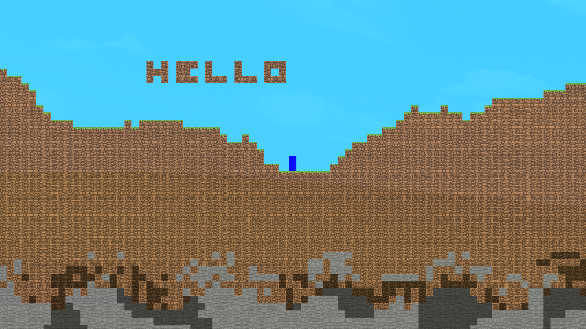

# astatine
> 2D sandbox game written in rust

wont be updating this repo anymore  
new rewrite in lumixing/astatine-test  
will continue dev when i learn more about bevy  
dont wanna be writing so many rewrites due to my lack of knowledge :(

still in like pre-pre-pre-alpha  
updating whenever :)

# screenshots

# features
- cool chunk manager which manages the world using 32x32 block chunks
- revolutionary procedural world terrain generation
- never seen before physics *and* collisions
- primitive player movement
- cutting edge debugging tools
    - debugging text
    - draw collision boxes
    - draw chunk boundaries
    - crashes
- and a lot more to come!

# libraries
written in rust and using:
- [bevy](https://bevyengine.org/) as the game engine

# older versions
- https://github.com/lumixing/old-astatine (rust)
- https://github.com/lumixing/astatine-kt (kotlin)
- https://github.com/lumixing/astatine-java (java)

# also see
- https://github.com/egordorichev/LastTry (java)
- https://github.com/jmrapp1/TerraLegion (java)
- https://github.com/hexabeast/HexBox (java)
- https://github.com/ktualhu/Minecube-Terraria-clone (java)
- https://github.com/NaulaN/Terraria-javafx (java)
- https://github.com/nazarlvr/Game-project (java)
- https://github.com/sreich/ore-infinium (kotlin)
- https://github.com/FergusGriggs/Fegaria-Remastered (python)
